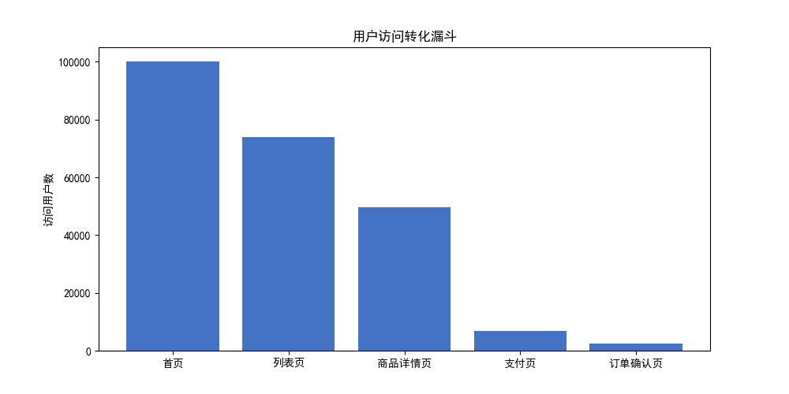
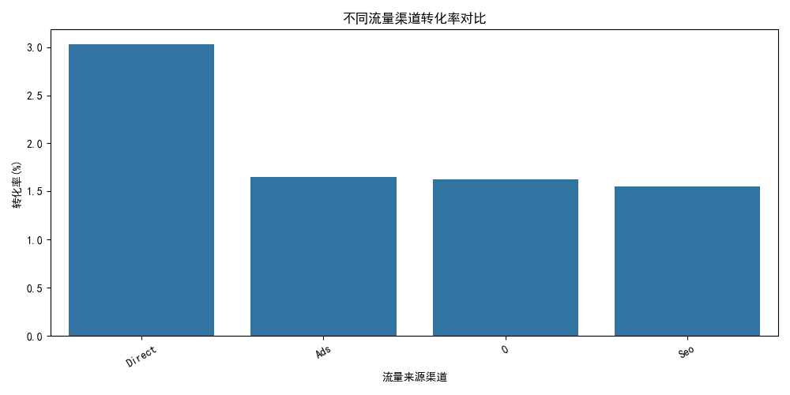
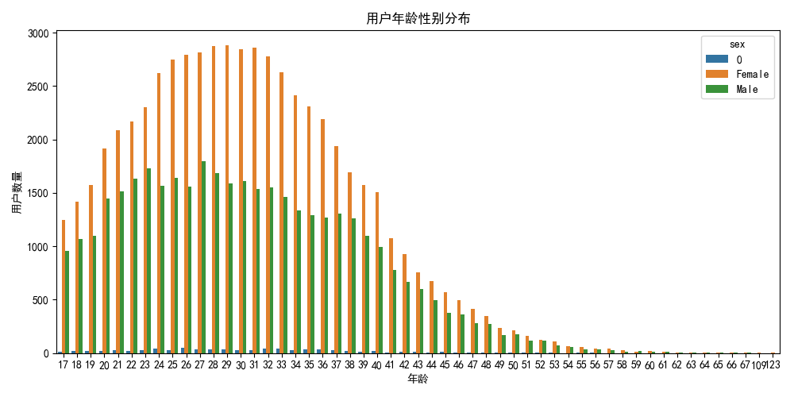

# 用户网站转化行为数据分析
> Python + MySQL 数据分析项目

## 项目简介
本项目基于网站用户访问CSV原始数据集，使用Pandas完成数据清洗，通过SQLAlchemy将清洗后数据批量写入MySQL数据库。
使用SQL进行多维度指标统计，搭建用户全链路转化漏斗，分析不同流量渠道转化率，绘制用户年龄性别画像。
可视化使用Matplotlib、Seaborn，定位用户核心流失节点，输出业务运营优化建议。

## 技术栈
Python、Pandas、MySQL、SQL、SQLAlchemy、Matplotlib、Seaborn

## 文件说明
- 电商用户购买行为.py：主代码文件，数据读取、入库、SQL查询、绘图
- 用户行为数据.csv：原始数据集
- Figure_1.png：全链路转化漏斗图
- Figure_2.png：各流量渠道转化对比
- Figure_3.png：用户年龄性别分布画像

## 项目分析结论
1. 用户最大流失节点：商品详情页跳转支付页面，大量访客在此放弃下单。
2. Direct直接访问用户转化率最高，Ads付费广告流量转化率偏低，流量质量较差。

## 可视化成果

